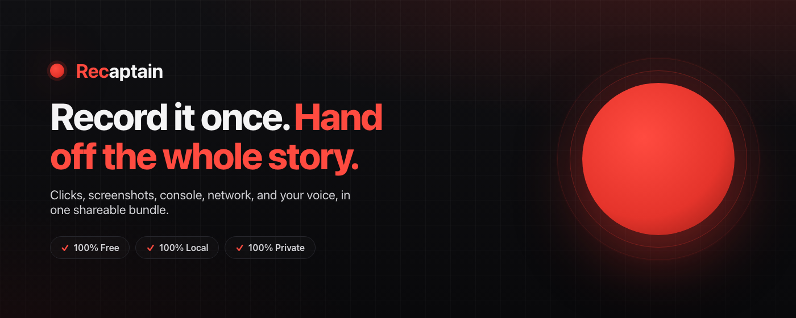

# Recaptain



> **Document automations and bugs by recording browser sessions.** Clicks, screenshots, console, network: all with your voice narration (or not).

**Chrome Extension. 100% Free. 100% Local. 100% Private.**

Browser extension that records a web session into a shareable bundle:

- **Semantic user interactions** (click, dblclick, input, change, key, submit, navigation, tab switch, focus, scroll) with Playwright-compatible locator suggestions per target. Intent markers (`marker`, `note`), auto-emitted `idle`, and `pause`/`resume`/`timeout` events are also included.
- **Network metadata**: one event per fetch/XHR (URL, method, status, timing). Operator-gated; response bodies sub-gated.
- **Assertions**: Cmd/Ctrl+Shift+A opens an overlay over the hovered element to attach a check (visible / has-text / count / etc).
- **Waiting windows**: heuristic detector emits `waiting_start` / `waiting_end` for windows where the page is busy and the operator is idle. Excluded from the active-time budget.
- **Landmark snapshots**: one structured DOM digest per navigation (headings, nav, main regions). Powers `pages.json` + `RECAP.md`.
- **Microphone audio** (WebM/Opus, via offscreen document, paused during waiting windows).
- **Periodic + event-triggered screenshots** of the active tab, redacted by default (sensitive inputs and opt-out elements painted over before encoding).

Output is a single `.zip` bundle the operator can hand off: no server, no auth, no backend. Anyone downstream (e.g. `wb capture <bundle>`) can unpack and do whatever with it.

## Bundle layout

```
<stamp>__<label>.zip
├── manifest.json            # id, label, start_url, duration, counts, UA, privacy, capture_model
├── index.html               # self-contained viewer (double-click to open in browser)
├── viewer.css
├── viewer.js
├── RECAP.md                 # dense LLM-readable digest of the session
├── replay.spec.ts           # mechanical Playwright export, runnable as-is
├── events.json              # semantic event stream (interactions, network, assertions, waiting, …)
├── console.json             # captured console entries (log/info/warn/error/debug/trace + uncaught errors)
├── tabs.json                # tab timeline [{tab_id, url, entered_at, left_at}]
├── pages.json               # landmark snapshots deduped by canonical URL
├── audio.webm               # mic audio (if enabled)
├── README.md                # consumer-facing guide baked into the bundle
├── PROMPT.md                # LLM prompt for turning the bundle into a runbook
└── screenshots/
    ├── index.json           # [{file, t, reason, tab_id, url, mask_rects, redaction_mode}]
    ├── 0000.png             # or .jpg past the 20MB cumulative threshold
    ├── 0001.png
    └── …
```

The recorder records. Nothing more. Interpretation is the consumer's job.

### Capture model

The recorder emits lightweight semantic events rather than a full DOM trace. Each interaction is one small entry with a target descriptor carrying Playwright-style locator suggestions (`getByTestId`, `getByRole`, `getByLabel`, `getByPlaceholder`, `getByText`, `locator(css)`) ordered by preferred stability, plus `locator_matches` so a downstream consumer can pick an unambiguous one. Output is orders of magnitude smaller than an rrweb-style snapshot and is still enough for a consumer (Claude, Playwright) to reproduce or narrate the flow. The manifest declares `format: "recaptain-recording/2.2"`.

### Privacy

- **Sensitive inputs are masked by default.** `password`/`email`/`tel` types, any field whose `name`/`id`/`label`/`autocomplete` matches a sensitive-attribute regex (`password|secret|token|ssn|cc|cvv|otp|email|login|…`), and explicit opt-outs (`.recaptain-mask`, `[data-recaptain-mask]`, `[data-sensitive]`) are emitted with `is_masked: true` and `value_length` only; the raw value is dropped.
- **URLs have high-entropy query params scrubbed** before they land in events/navigation/tab records.
- **Console messages matching redaction patterns are scrubbed** before being written to `console.json`.
- **Screenshots are redacted by default.** Every element matching the masked-input or vendor opt-out rules (LogRocket, FullStory, PostHog, Hotjar, Heap, Mixpanel, Amplitude data-attrs and class names) has its bounding box painted over before encoding. Operator picks the mode: `black` (default), `blur`, or `off`. Per-shot `mask_rects` + `redaction_mode` are persisted in `screenshots/index.json` for auditability.

## Install (dev)

```bash
npm install
npm run build
```

Then in Chrome:

1. Open `chrome://extensions`
2. Enable **Developer mode**
3. Click **Load unpacked** → select `recaptain/dist/`

Use `npm run watch` for live rebuilds.

## Use

1. Click the extension icon: opens the side panel.
2. (Optional) add a label like `airbase/expense-sync`. Toggle mic, network capture, screenshot capture, redaction mode.
3. Click **Start**: first run prompts for microphone permission.
4. Do the flow. Use Cmd/Ctrl+Shift+A to attach an assertion to the hovered element. Drop intent markers / notes from the side panel.
5. Click **Stop**. Two destinations:
   - **Download** (default): a `.zip` bundle lands in your Downloads folder.
   - **Project**: pick a directory once, the bundle is written unzipped into a timestamped subfolder. Re-prompts for permission on the next start (Chrome doesn't persist directory grants across browser restarts).
6. Double-click `index.html` (or open the zip's viewer) to scrub through the recording locally.

## Permissions

- `<all_urls>` (optional host access): requested the first time you click Start, inside that click, so no site access is granted at install. It lets the recorder inject into, and screenshot, whatever page you choose to record. You can revoke it any time from the side panel; without it there is nothing to capture.
- `tabs`, `scripting`: coordinate and inject the recording across navigations
- `downloads`: save the bundle
- `offscreen`: record mic in an offscreen document (MV3 service workers can't)

No network permissions. The extension never makes outbound requests.

## Downstream: turning a bundle into a runbook

A bundle is raw material, not a runbook. Two artifacts help turn it into one:

- **`README.md` + `PROMPT.md` baked into every bundle.** The README explains the file layout to a human or agent opening the zip. The PROMPT is a ready-to-use LLM prompt that takes the bundle contents and produces a runbook.
- **`scripts/bundle-to-skeleton.mjs`** in this repo, a reference mechanical converter (no LLM) that walks a bundle and emits a runbook skeleton. Useful as a starting point or for pipelines that can't call out to a model.
